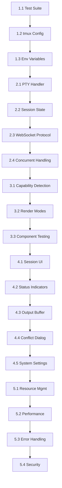

# Implementation Plan: Persistent Terminal Sessions with Ink Rendering

<!-- Document Metadata
Created: 2025-07-11
Modified: 2025-07-11
Status: ????
-->


## Phase 1: Foundation & Testing (Week 1)

### 1.1 Create Terminal Test Suite
- Build isolated test environment to validate Ink rendering
- Test cases for:
  - Box drawing characters
  - Color gradients (256 color and true color)
  - Unicode characters
  - Cursor positioning
  - Screen clearing/redrawing
- Create visual regression tests using screenshot comparison

### 1.2 Update tmux Configuration
- Create optimized `.tmux.conf` for modern terminals:
  ```bash
  # simple/.tmux.conf.ink
  set -g default-terminal "screen-256color"
  set -ga terminal-overrides ",*256col*:Tc"
  set -as terminal-features ",*:RGB"
  set -g focus-events on
  set -s escape-time 0
  set -g mouse on
  ```
- Add environment detection script to auto-select config
- Document required tmux version (2.9+ for best results)

### 1.3 Environment Variable Strategy
- Create terminal capability detection module
- Implement environment setup for optimal rendering:
  - `TERM` detection and override logic
  - `COLORTERM=truecolor` propagation
  - UTF-8 locale enforcement
  - Ink-specific optimizations

## Phase 2: Core Integration (Week 1-2)

### 2.1 Enhance PTY Terminal Handler
- Add session persistence layer:
  ```javascript
  class PersistentPtyHandler {
    constructor() {
      this.sessions = new Map();
      this.tmuxSessions = new Map();
    }
    
    async createSession(id, options) {
      // Check for existing tmux session
      // Create new if needed
      // Store mapping
    }
    
    async reconnectSession(id) {
      // Reattach to existing tmux session
      // Restore terminal size
      // Replay recent output if buffered
    }
  }
  ```

### 2.2 Session State Management
- Extend SQLite schema for terminal sessions:
  - Session ID → tmux session name mapping
  - Terminal dimensions
  - Environment variables
  - Last activity timestamp
  - Output buffer (optional)
- Implement session lifecycle (create, reconnect, cleanup)

### 2.3 WebSocket Reconnection Protocol
- Add reconnection handshake:
  1. Client sends previous session ID
  2. Server checks if tmux session exists
  3. If yes: reattach and send buffered output
  4. If no: create new session with same ID
- Handle graceful disconnection vs timeout

### 2.4 Concurrent Session Handling

#### 2.4.1 Session Conflict Detection
- Track active connections per session:
  ```javascript
  class SessionManager {
    constructor() {
      this.activeSessions = new Map(); // sessionId -> {clientId, mode, timestamp}
    }
    
    async connectToSession(sessionId, clientId, wsConnection) {
      const existing = this.activeSessions.get(sessionId);
      
      if (existing && existing.clientId !== clientId) {
        // Send conflict notification
        wsConnection.send(JSON.stringify({
          type: 'session_conflict',
          sessionId,
          currentClient: existing.clientId,
          message: 'This session is already open in another browser'
        }));
        return;
      }
      
      // No conflict, proceed
      this.activeSessions.set(sessionId, {
        clientId, 
        mode: 'control',
        timestamp: Date.now()
      });
    }
  }
  ```

#### 2.4.2 User Choice Handling
- Implement three options for session conflicts:
  
  **Option 1: View Only Mode**
  ```bash
  # Attach in read-only mode
  tmux attach-session -t $SESSION_NAME -r
  ```
  
  **Option 2: Take Control**
  ```bash
  # Force detach other clients and take control
  tmux attach-session -d -t $SESSION_NAME
  ```
  - Notify previous controller: "Your session was taken over"
  - Transfer control atomically
  
  **Option 3: Cancel**
  - Close connection without attaching

#### 2.4.3 Notification System
- WebSocket messages for session state changes:
  ```javascript
  // To previous controller
  {
    type: 'session_taken_over',
    sessionId: 'project-123',
    newController: 'browser-456',
    timestamp: Date.now()
  }
  
  // To new controller
  {
    type: 'session_control_granted',
    sessionId: 'project-123',
    previousController: 'browser-123'
  }
  ```

## Phase 3: Ink Compatibility Layer (Week 2)

### 3.1 Terminal Capability Detection
- Create Ink wrapper that detects environment:
  ```javascript
  function createInkApp(Component, options = {}) {
    const isTmux = process.env.TMUX !== undefined;
    const terminalCapabilities = detectCapabilities();
    
    if (isTmux && !terminalCapabilities.fullColor) {
      // Use fallback rendering
    }
    
    return render(Component, {
      ...options,
      experimental: true // Enable latest Ink features
    });
  }
  ```

### 3.2 Rendering Optimization
- Implement render mode selection:
  - **Full mode**: All Ink features for direct terminal
  - **Compatible mode**: Adjusted for tmux with some limitations
  - **Fallback mode**: Basic ASCII art for degraded terminals
- Add render mode indicator to UI

### 3.3 Test Critical Claude Components
- Validate each Claude UI component in tmux
- Fix any rendering issues:
  - Adjust box drawing characters if needed
  - Ensure proper line wrapping
  - Verify color schemes
  - Test interactive elements

## Phase 4: User Experience (Week 2-3)

### 4.1 Session Discovery UI
- Add session list to mobile app:
  - Active sessions with age
  - Last command/status
  - Quick reconnect button
- Implement session naming for easy identification

### 4.2 Connection Status Indicator
- Show connection state in terminal header:
  - 🟢 Connected
  - 🟡 Reconnecting
  - 🔴 Disconnected (session preserved)
- Add toast notifications for state changes

### 4.3 Output Buffering
- Implement smart output buffer:
  - Keep last 1000 lines while disconnected
  - Compress if over size limit
  - Option to download full log
- Show "missed output" indicator on reconnect

### 4.4 Session Conflict Dialog
- Mobile-friendly dialog for handling conflicts:
  ```javascript
  const SessionConflictDialog = ({sessionInfo, onChoice}) => {
    return (
      <Modal>
        <Text>Session Already Active</Text>
        <Text>This session is open in {sessionInfo.deviceName}</Text>
        <Text>Last active: {sessionInfo.lastActive}</Text>
        
        <Button 
          title="View Only" 
          subtitle="Watch without interrupting"
          onPress={() => onChoice('view_only')} 
        />
        <Button 
          title="Take Control" 
          subtitle="Interrupt the other session"
          onPress={() => onChoice('take_control')} 
        />
        <Button 
          title="Cancel" 
          onPress={() => onChoice('cancel')} 
        />
      </Modal>
    );
  };
  ```

### 4.5 System Settings
- Add user preferences:
  ```sql
  ALTER TABLE user_settings ADD COLUMN 
    allow_session_interruption BOOLEAN DEFAULT true;
  
  ALTER TABLE user_settings ADD COLUMN 
    session_conflict_default TEXT DEFAULT 'ask';
    -- Options: 'ask', 'always_view', 'always_control', 'always_cancel'
  ```
- Settings UI in mobile app:
  - Toggle for allowing interruptions
  - Default conflict behavior
  - Session timeout settings

## Phase 5: Production Hardening (Week 3)

### 5.1 Resource Management
- Implement session limits:
  - Max sessions per user
  - Auto-cleanup after inactivity (configurable)
  - Resource usage monitoring
- Add admin tools for session management

### 5.2 Performance Optimization
- Connection pooling for tmux commands
- Lazy loading of session data
- Efficient output streaming
- Battery-conscious mobile updates

### 5.3 Error Handling
- Graceful degradation if tmux unavailable
- Fallback to non-persistent mode
- Clear error messages for users
- Automatic recovery attempts

### 5.4 Session Security
- Validate session ownership before allowing control
- Implement session tokens for reconnection
- Audit log for session access
- Optional PIN/biometric for taking control

## Implementation Order & Dependencies



## Risk Mitigation

1. **Rendering Issues**: Maintain non-tmux fallback path
2. **Performance**: Implement progressive enhancement
3. **Compatibility**: Test on multiple terminal emulators
4. **User Confusion**: Clear documentation and UI hints
5. **Resource Leaks**: Automatic session cleanup
6. **Conflict Resolution**: Clear UI for session ownership

## Success Metrics

- [ ] Ink apps render identically in tmux vs direct terminal
- [ ] Session reconnection works within 2 seconds
- [ ] Zero data loss during disconnection
- [ ] Mobile battery impact < 5% increase
- [ ] User satisfaction with persistence feature
- [ ] Conflict resolution takes < 3 taps
- [ ] 95% of sessions reconnect successfully

## Testing Strategy

### Unit Tests
- Session state management
- Conflict detection logic
- tmux command generation
- WebSocket message handling

### Integration Tests
- Full reconnection flow
- Concurrent connection handling
- Conflict resolution scenarios
- Session timeout and cleanup

### E2E Tests
- Mobile app → terminal → tmux flow
- Multi-tab session conflicts
- Network interruption recovery
- Long-running session persistence

This plan provides a systematic approach to adding persistence while preserving the high-quality terminal experience and handling concurrent access gracefully.