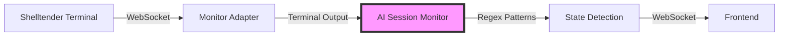
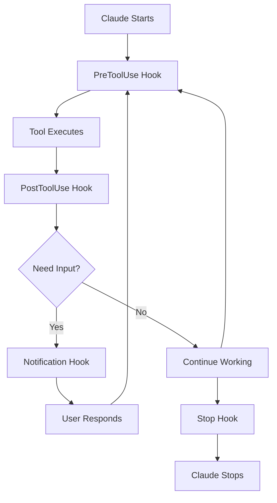
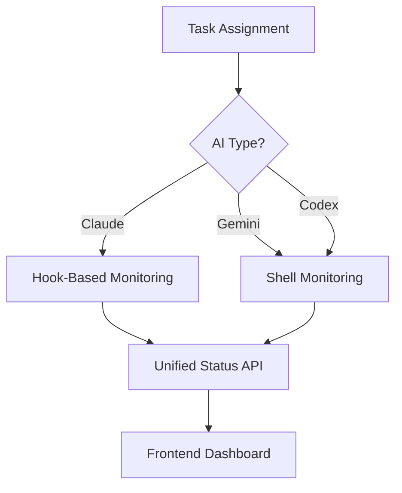

# Claude Hooks Migration Guide: From Shell Monitoring to Deterministic Hooks

> **Note**: This document describes a future implementation plan for migrating PocketDev's AI monitoring system from shell-based text detection to Claude's new hooks feature. This is not yet implemented but serves as a technical reference for when Claude hooks become available in our environment.

## Implementation Status

- **Current State**: Shell-based monitoring via Shelltender (ACTIVE)
- **Future State**: Claude hooks integration (PLANNED)
- **Target Timeline**: When Claude Code is updated in ai-base Docker image

## Table of Contents
1. [Executive Summary](#executive-summary)
2. [Current Implementation: Shell-Based Monitoring](#current-implementation-shell-based-monitoring)
3. [Claude Hooks: The Better Way](#claude-hooks-the-better-way)
4. [Technical Comparison](#technical-comparison)
5. [Migration Strategy](#migration-strategy)
6. [Implementation Guide](#implementation-guide)
7. [Testing & Validation](#testing--validation)
8. [Rollback Plan](#rollback-plan)
9. [Future Considerations](#future-considerations)

## Executive Summary

PocketDev currently monitors AI developers (Claude, Gemini, Codex) by parsing terminal output using regex patterns. While functional, this approach is fragile and requires constant maintenance. Claude's new hooks feature offers a deterministic, event-driven alternative that will make our monitoring more reliable and maintainable.

**Key Benefits:**
- 🎯 **Deterministic**: Hooks fire at exact moments, no guessing from terminal output
- 🚀 **Performance**: No continuous text parsing overhead
- 🔧 **Maintainable**: No regex patterns to update when Claude's UI changes
- 📊 **Rich Data**: Access to actual tool parameters and results
- 🔄 **Compatible**: Can run alongside existing system during migration

## Current Implementation: Shell-Based Monitoring

### Architecture Overview



### How It Works

1. **ShelltenderMonitorAdapter** (`simple/server/shelltender-monitor-adapter.js`)
   - Connects to Shelltender via WebSocket in monitor mode
   - Receives ALL terminal output from ALL sessions
   - Forwards raw terminal data to callbacks

2. **AISessionMonitor** (`simple/server/ai-session-monitor.js`)
   - Registers ~12 regex patterns to detect AI states
   - Parses terminal output character by character
   - Maintains state machines for each session

3. **Pattern Examples**:
   ```javascript
   // Claude thinking animation
   /([✻●◉◎✢✶✽✺○·])\s+\w+ing….*\d+s.*tokens/
   
   // Claude prompt (idle)
   /│\s*>\s*│/
   
   // Confirmation prompt
   /│\s*(\d+)\.\s+(.+?)\s*│/
   ```

### Current States Tracked

- `IDLE` - Gray (bash prompt visible)
- `RUNNING` - Blue (Claude prompt visible)
- `THINKING` - Yellow (animation with "ing...")
- `WAITING_INPUT` - Purple (confirmation needed)
- `COMPLETED` - Green (task done)
- `ERROR` - Red (error detected)

### Problems with Current Approach

1. **Fragility**: Terminal UI changes break patterns
2. **Performance**: Parsing ALL output from ALL sessions continuously
3. **False Positives**: Patterns match unintended output
4. **Complexity**: 500+ lines of regex pattern matching
5. **Timing Issues**: Race conditions between patterns

## Claude Hooks: The Better Way

### What Are Hooks?

Claude hooks are user-defined shell commands that execute at specific points in Claude's lifecycle:



### Hook Events Available

1. **PreToolUse**: Before any tool runs (Edit, Bash, Read, etc.)
2. **PostToolUse**: After tool completes
3. **Notification**: When Claude needs user input
4. **Stop**: When Claude finishes responding

### Hook Input Data

Each hook receives JSON via stdin:

```json
{
  "session_id": "task-abc123",
  "transcript_path": "~/.claude/projects/.../session.jsonl",
  "tool_name": "Bash",
  "tool_input": {
    "command": "npm test",
    "description": "Running tests"
  }
}
```

## Technical Comparison

| Aspect | Shell Monitoring | Claude Hooks |
|--------|-----------------|--------------|
| **Reliability** | Regex patterns can fail | Deterministic events |
| **Performance** | Continuous parsing | Event-driven |
| **Maintenance** | Update patterns regularly | Stable API |
| **Data Quality** | Parsed from text | Structured JSON |
| **Latency** | Depends on buffer flushing | Immediate |
| **Multi-tool Support** | Yes (all terminals) | Claude only |

## Migration Strategy

### Phase 1: Parallel Implementation (Weeks 1-2)
- Deploy hooks alongside existing monitoring
- Log both systems' outputs for comparison
- Validate hook reliability

### Phase 2: Hook Integration (Weeks 3-4)
- Route hook events to existing WebSocket infrastructure
- Update frontend to prefer hook-based status
- Keep shell monitoring as fallback

### Phase 3: Optimization (Weeks 5-6)
- Remove redundant pattern matching for Claude
- Optimize for other AI tools still using shell
- Performance testing

### Phase 4: Cleanup (Week 7)
- Remove Claude-specific regex patterns
- Document new architecture
- Update monitoring dashboards

## Implementation Guide

### Step 1: Understanding Hook File Locations

**IMPORTANT**: Hook files must be placed in the Shelltender server environment where Claude Code runs, NOT in the PocketDev project directory.

#### File Locations:

1. **Hook Configuration** (`.claude/settings.json`):
   - Location: Inside the `ai-base` Docker container at `/home/pocketdev/.claude/settings.json`
   - This is the home directory of the `pocketdev` user running Claude Code
   - Must be accessible to ALL Claude Code sessions

2. **Hook Scripts** (Python/Bash scripts):
   - Location: Inside the `ai-base` Docker container at `/home/pocketdev/.claude/hooks/`
   - Scripts must be executable (`chmod +x`)
   - Must be in the PATH or use absolute paths

3. **Per-Project Hooks** (Optional):
   - Location: `/workspace/<project>/.claude/settings.json`
   - Used for project-specific hooks
   - Merged with user settings

#### Docker Image Updates Required:

The `ai-base` Dockerfile needs to include:
```dockerfile
# Create hook directories
RUN mkdir -p /home/pocketdev/.claude/hooks

# Copy hook scripts
COPY hooks/* /home/pocketdev/.claude/hooks/
RUN chmod +x /home/pocketdev/.claude/hooks/*

# Copy default settings
COPY claude-settings.json /home/pocketdev/.claude/settings.json
RUN chown -R pocketdev:pocketdev /home/pocketdev/.claude
```

### Step 2: Create Hook Configuration

Create `simple/docker/ai-base/claude-settings.json`:

```json
{
  "hooks": {
    "PreToolUse": [
      {
        "matcher": "",
        "hooks": [
          {
            "type": "command",
            "command": "python3 /home/pocketdev/.claude/hooks/track-status.py"
          }
        ]
      }
    ],
    "PostToolUse": [
      {
        "matcher": "",
        "hooks": [
          {
            "type": "command",
            "command": "python3 /home/pocketdev/.claude/hooks/track-status.py"
          }
        ]
      }
    ],
    "Notification": [
      {
        "matcher": "",
        "hooks": [
          {
            "type": "command",
            "command": "python3 /home/pocketdev/.claude/hooks/notify-user.py"
          }
        ]
      }
    ],
    "Stop": [
      {
        "matcher": "",
        "hooks": [
          {
            "type": "command",
            "command": "python3 /home/pocketdev/.claude/hooks/session-complete.py"
          }
        ]
      }
    ]
  }
}
```

### Step 3: Create Hook Processing Scripts

Create `simple/docker/ai-base/hooks/track-status.py`:

```python
#!/usr/bin/env python3
import json
import sys
import requests
from datetime import datetime

def main():
    try:
        # Read hook input
        input_data = json.load(sys.stdin)
        
        # Extract relevant data
        session_id = input_data.get('session_id', '')
        tool_name = input_data.get('tool_name', '')
        tool_input = input_data.get('tool_input', {})
        
        # Map hook event to PocketDev state
        if 'tool_response' in input_data:
            # PostToolUse
            state = 'running'  # Claude is idle after tool completes
        else:
            # PreToolUse
            state = 'working'
            
        # Send update to PocketDev server
        # Note: This assumes PocketDev server is accessible from within the container
        # In production, this might need to use the Docker host network or service discovery
        payload = {
            'sessionId': session_id,
            'state': state,
            'tool': tool_name,
            'timestamp': datetime.now().isoformat(),
            'details': {
                'tool_name': tool_name,
                'tool_input': tool_input
            }
        }
        
        # Use host.docker.internal for Docker Desktop or the actual host IP
        pocketdev_url = 'http://host.docker.internal:3003/api/ai-status'
        
        response = requests.post(
            pocketdev_url,
            json=payload,
            timeout=2
        )
        
        # Exit successfully
        sys.exit(0)
        
    except Exception as e:
        # Log error but don't block Claude
        print(f"Hook error: {e}", file=sys.stderr)
        sys.exit(1)

if __name__ == '__main__':
    main()
```

### Step 4: Update AI Base Docker Image

Create `simple/docker/ai-base/Dockerfile.ai-base`:

```dockerfile
FROM ubuntu:22.04

# Install dependencies including Python for hooks
RUN apt-get update && apt-get install -y \
    python3 \
    python3-pip \
    python3-requests \
    curl \
    jq \
    && rm -rf /var/lib/apt/lists/*

# Create pocketdev user (if not already created)
RUN useradd -m -s /bin/bash pocketdev || true

# Create hook directories
RUN mkdir -p /home/pocketdev/.claude/hooks

# Copy hook scripts
COPY hooks/* /home/pocketdev/.claude/hooks/
RUN chmod +x /home/pocketdev/.claude/hooks/*

# Copy Claude settings
COPY claude-settings.json /home/pocketdev/.claude/settings.json

# Set ownership
RUN chown -R pocketdev:pocketdev /home/pocketdev/.claude

# Switch to pocketdev user
USER pocketdev
WORKDIR /home/pocketdev

# Install Claude Code and other AI tools
# ... rest of Dockerfile
```

### Step 5: Backend API Endpoint

Add to `simple/server/routes/monitoring.routes.js`:

```javascript
// New endpoint for hook-based status updates
router.post('/api/ai-status', async (req, res) => {
  try {
    const { sessionId, state, tool, timestamp, details } = req.body;
    
    // Map hook states to existing AIStates
    const stateMap = {
      'working': AIStates.WORKING,
      'running': AIStates.RUNNING,
      'waiting_input': AIStates.WAITING_INPUT,
      'completed': AIStates.COMPLETED,
      'error': AIStates.ERROR
    };
    
    // Update via existing monitor system
    if (aiMonitor && stateMap[state]) {
      const tracker = aiMonitor.stateTrackers.get(sessionId);
      if (tracker) {
        tracker.updateState(stateMap[state], {
          source: 'hook',
          tool,
          timestamp,
          ...details
        });
        aiMonitor.broadcastStateUpdate(sessionId, tracker.getStatus());
      }
    }
    
    res.json({ success: true });
  } catch (error) {
    console.error('Error processing hook status:', error);
    res.status(500).json({ error: error.message });
  }
});
```

### Step 6: Frontend Integration

Update `simple/frontend/src/hooks/useAIStatus.ts`:

```typescript
import { useEffect, useState } from 'react';

export function useAIStatus(taskId: string) {
  const [status, setStatus] = useState('idle');
  const [lastUpdate, setLastUpdate] = useState<Date | null>(null);
  
  useEffect(() => {
    // Connect to WebSocket
    const ws = new WebSocket('ws://localhost:3003');
    
    ws.onmessage = (event) => {
      const data = JSON.parse(event.data);
      
      if (data.type === 'ai_state_update' && 
          data.sessionId === `task-${taskId}`) {
        setStatus(data.data.currentState);
        setLastUpdate(new Date());
      }
    };
    
    return () => ws.close();
  }, [taskId]);
  
  return { status, lastUpdate };
}
```

## Testing & Validation

### Test Scenarios

1. **State Transition Testing**
   ```bash
   # Test script to verify all state transitions
   ./test-hooks.sh
   ```

2. **Performance Comparison**
   - Measure CPU usage: Shell parsing vs. Hooks
   - Measure latency: Time to detect state change
   - Memory usage comparison

3. **Reliability Testing**
   - Run 100 Claude sessions
   - Compare state detection accuracy
   - Log any mismatches

### Validation Checklist

- [ ] All Claude states detected correctly
- [ ] No duplicate state updates
- [ ] Frontend updates in real-time
- [ ] Non-Claude tools still work
- [ ] Performance improved
- [ ] No security issues with hooks

## Rollback Plan

If issues arise during migration:

1. **Immediate Rollback**
   - Remove `.claude/settings.json`
   - Claude reverts to normal operation
   - Shell monitoring continues working

2. **Partial Rollback**
   - Keep hooks for logging only
   - Use shell monitoring for state detection
   - Debug issues while system runs

3. **Data Preservation**
   - All hook events logged to file
   - Can replay events for debugging
   - No data loss during rollback

## Docker Architecture Considerations

### Network Communication

Since Claude Code runs inside the `ai-base` container, hooks need to communicate with the PocketDev server. Here are the networking options:

1. **Docker Host Network** (Development)
   ```python
   # Use host.docker.internal on Docker Desktop
   pocketdev_url = 'http://host.docker.internal:3003/api/ai-status'
   ```

2. **Docker Compose Network** (Production)
   ```yaml
   # docker-compose.yml
   services:
     shelltender:
       image: ai-base:latest
       networks:
         - pocketdev-network
     
     pocketdev-server:
       networks:
         - pocketdev-network
   ```
   ```python
   # Use service name
   pocketdev_url = 'http://pocketdev-server:3003/api/ai-status'
   ```

3. **Environment Variables** (Flexible)
   ```dockerfile
   # In Dockerfile
   ENV POCKETDEV_API_URL=http://localhost:3003
   ```
   ```python
   # In hook script
   pocketdev_url = os.environ.get('POCKETDEV_API_URL', 'http://localhost:3003') + '/api/ai-status'
   ```

### Session ID Mapping

Claude Code generates its own session IDs, but PocketDev uses task IDs. We need to map between them:

1. **Option 1: Environment Variable per Task**
   ```bash
   # When starting Claude for a task
   docker exec -e POCKETDEV_TASK_ID=task-abc123 shelltender claude
   ```

2. **Option 2: Session Metadata File**
   ```json
   // /workspace/.pocketdev/session-metadata.json
   {
     "task_id": "task-abc123",
     "project_id": "proj-xyz789",
     "started_at": "2024-01-01T00:00:00Z"
   }
   ```

3. **Option 3: Parse from Working Directory**
   ```python
   # Hook extracts task ID from path
   # /workspace/task-abc123/project-name
   cwd = os.getcwd()
   task_id = cwd.split('/')[2] if 'task-' in cwd else None
   ```

### Security Considerations

1. **API Authentication**
   ```python
   # Add authentication to hook requests
   headers = {
       'Authorization': f'Bearer {os.environ.get("POCKETDEV_API_KEY")}',
       'Content-Type': 'application/json'
   }
   ```

2. **Network Isolation**
   - Hooks should only communicate with PocketDev API
   - Use Docker network policies to restrict access
   - Log all hook executions for audit

3. **Error Handling**
   - Hooks must never block Claude's operation
   - Use short timeouts (2 seconds max)
   - Fail silently with error logging

## Future Considerations

### Enhanced Features with Hooks

1. **Automatic Code Formatting**
   ```json
   {
     "PostToolUse": [{
       "matcher": "Write|Edit",
       "hooks": [{
         "type": "command",
         "command": "prettier --write $FILE_PATH"
       }]
     }]
   }
   ```

2. **Security Scanning**
   - Block commits with secrets
   - Scan for vulnerabilities
   - Enforce coding standards

3. **Audit Trail**
   - Log all AI actions to database
   - Track which AI made which changes
   - Compliance reporting

### Multi-AI Architecture



### Performance Optimizations

1. **Batch Hook Updates**: Combine multiple events
2. **Edge Processing**: Run hooks on AI server
3. **Caching**: Reduce API calls for status

## Conclusion

Migrating to Claude hooks will make PocketDev's AI monitoring more reliable, performant, and maintainable. The phased approach ensures zero downtime while providing immediate benefits. The architecture remains flexible for future AI tools while optimizing for Claude's advanced capabilities.

**Next Steps:**
1. Review and approve migration plan
2. Set up development environment for testing
3. Begin Phase 1 implementation
4. Schedule weekly migration reviews