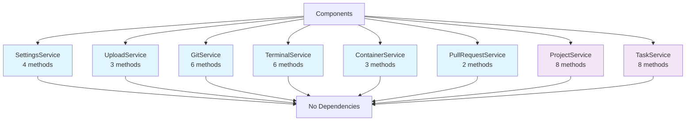

# Service Dependency Graph

<!-- Document Metadata
Created: 2025-08-03
Modified: 2025-08-03
Status: ????
-->

## Service Dependencies

## Component-Service Usage Matrix

| Component | Settings | Upload | Git | Terminal | Container | PR | Project | Task |
|-----------|:--------:|:------:|:---:|:--------:|:---------:|:--:|:-------:|:----:|
| **TerminalPanel** | | | ✓ | ✓✓✓ | | | | ✓✓ |
| **ProjectDashboard** | | | | | | | ✓✓✓ | ✓ |
| **TaskWorkspace** | | | ✓✓ | ✓ | ✓✓ | ✓ | | ✓✓✓ |
| **DiffViewerModal** | | | ✓✓✓ | | | | | |
| **CommitModal** | | | ✓✓✓ | | | | | |
| **Projects** | | | | | | | ✓✓ | |
| **CreateProjectModal** | | | | | | | ✓ | |
| **ImageUpload** | | ✓✓ | | | | | | |
| **Sidebar** | | | | | | | ✓ | |
| **StandaloneTerminal** | | | | ✓ | | | | |

Legend: ✓ = Light usage, ✓✓ = Medium usage, ✓✓✓ = Heavy usage

## Extraction Risk Assessment

### Low Risk (Phase 1)
- **SettingsService**: Used by settings pages only
- **UploadService**: Used by specific upload components only

### Medium Risk (Phase 2)  
- **GitService**: Used by diff viewers and commit flows
- **TerminalService**: Used by terminal components
- **ContainerService**: Limited component usage
- **PullRequestService**: Simple, minimal usage

### High Risk (Phase 3)
- **ProjectService**: Central to navigation and dashboard
- **TaskService**: Core to most task-related components

## Migration Order Rationale

1. **Independent services first**: No cross-dependencies
2. **Utility services next**: Git, Terminal (support other operations)
3. **Core domain last**: Project, Task (highest coupling)

## Service Isolation Benefits

### Before (Monolithic API)
- Single 49-method class
- Mixed responsibilities
- Hard to test individual domains
- Coupling between unrelated operations

### After (Domain Services)
- 8 focused services (2-8 methods each)
- Clear domain boundaries  
- Independent testing possible
- Reduced coupling between domains

## Implementation Notes

- **No service-to-service calls**: Each service is independent
- **Shared types**: Common types remain in `/types/` directory
- **HTTP client**: Shared base fetch functionality
- **Mock data**: Maintained in each service implementation