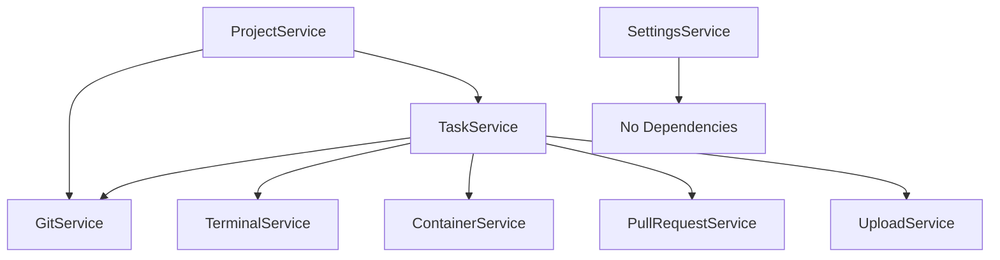

# Frontend API Service Migration Plan

<!-- Document Metadata
Created: 2025-08-03
Modified: 2025-08-03
Status: ????
-->


## Current State Analysis

The `api.ts` file contains **49 public methods** in a single class, violating the deep modules principle (should be 5-7 methods max). This analysis breaks down the extraction into domain services.

### Method Inventory by Domain

**Project Operations (11 methods)**
- `getProjectMinimal()` - Get basic project info
- `getProjects()` - List all projects
- `getProject()` - Get full project details
- `createProject()` - Create new project
- `getProjectBranches()` - List project branches
- `getProjectPlanning()` - Get planning document
- `updateProjectPlanning()` - Update planning document  
- `getProjectDashboard()` - Get dashboard data
- `getProjectDashboardCached()` - Get cached dashboard
- `pullBaseBranch()` - Pull base branch updates
- `pushBaseBranch()` - Push base branch changes
- `refreshProjectStatus()` - Trigger dashboard refresh

**Task Operations (8 methods)**
- `getTasks()` - List project tasks
- `getTasksMinimal()` - List tasks with minimal data
- `getTask()` - Get specific task
- `createTask()` - Create new task
- `updateTask()` - Update task details
- `archiveTask()` - Archive task
- `getCommitHistory()` - Get task commit history
- `updateBranch()` - Update task branch from base

**Git Operations (10 methods)**
- `getGitStatus()` - Get git status
- `getChangedFiles()` - Get changed files list
- `getAllChanges()` - Get comprehensive change summary
- `getTaskDiff()` - Get task diff view
- `getFileDiff()` - Get specific file diff
- `checkConflicts()` - Check for merge conflicts
- `gitOperation()` - Generic git operation
- `stageFile()` - Stage specific file
- `unstageFile()` - Unstage specific file
- `stageAndCommit()` - Stage and commit changes
- `mergeToBase()` - Merge task to base branch

**Pull Request Operations (1 method)**
- `createPR()` - Create pull request

**Container Operations (3 methods)**
- `deployContainers()` - Deploy task containers
- `stopContainers()` - Stop task containers
- `getContainerLogs()` - Get container logs

**Terminal Operations (6 methods)**
- `openTerminal()` - Open terminal session
- `getTerminalSessions()` - List terminal sessions
- `createTerminalSession()` - Create new terminal session
- `updateTerminalTab()` - Update terminal tab
- `deleteTerminalSession()` - Delete terminal session
- `executeCommand()` - Execute command in session

**Settings Operations (4 methods)**
- `getSettings()` - Get application settings
- `updateSettings()` - Update settings
- `testGithubToken()` - Test GitHub token
- `getSystemInfo()` - Get system information

**Upload Operations (3 methods)**
- `getTaskImages()` - List uploaded images
- `uploadTaskImage()` - Upload image file
- `deleteTaskImage()` - Delete uploaded image

**Core Infrastructure (3 methods)**
- `fetch()` - Private HTTP client method
- Constructor logic
- Mock data handling

## Service Extraction Plan

### Phase 1: Infrastructure & Settings (Low Risk)
Extract services with minimal dependencies and clear boundaries.

**Order:**
1. **SettingsService** (4 methods) - No dependencies on other services
2. **UploadService** (3 methods) - Only depends on projectId/taskId parameters

### Phase 2: Git & Terminal (Medium Risk)  
Extract git and terminal operations that are used by multiple components.

**Order:**
3. **GitService** (10 methods) - Used by diff viewers, commit flows
4. **TerminalService** (6 methods) - Used by terminal panels

### Phase 3: Core Domain Services (High Risk)
Extract main business logic services with high component coupling.

**Order:**
5. **ContainerService** (3 methods) - Limited usage, clear boundaries
6. **PullRequestService** (1 method) - Simple, limited dependencies  
7. **ProjectService** (12 methods) - Central to many components
8. **TaskService** (8 methods) - Heavily used, must be done last

### Phase 4: Migration Wrapper (Final)
9. **Create ApiService wrapper** - Maintain backward compatibility
10. **Update component imports** - Gradual migration per component
11. **Remove original ApiService** - After all components migrated

## Service Dependencies



**Dependency Analysis:**
- **SettingsService**: Independent
- **UploadService**: Independent  
- **GitService**: Independent (core git operations)
- **TerminalService**: Independent
- **ContainerService**: Independent
- **PullRequestService**: Independent
- **ProjectService**: Independent (project-level operations)
- **TaskService**: May call GitService for status updates

## Component Usage Analysis

### High-Impact Components (Multiple API methods)
- **TerminalPanel.tsx**: 6+ terminal methods, task methods
- **ProjectDashboard.tsx**: 5+ project methods
- **TaskWorkspace.tsx**: Task, git, container methods
- **DiffViewerModal.tsx**: Git diff methods
- **CommitModal.tsx**: Git operation methods

### Medium-Impact Components (2-3 API methods)
- **Projects.tsx**: Project listing methods
- **CreateProjectModal.tsx**: Project creation
- **Sidebar.tsx**: Project navigation
- **StandaloneTerminal.tsx**: Terminal methods

### Low-Impact Components (1 API method)
- **ImageUpload.tsx**: Upload methods only
- **useImageUpload.ts**: Upload hook

## Interface Design Strategy

### Method Reduction Strategy
Each service interface will have **5-7 methods maximum** by:

1. **Combining related operations**: `stageFile` + `stageAndCommit` → `stageAndCommit`
2. **Using options parameters**: `getTask` + `getTaskMinimal` → `getTask({ minimal?: boolean })`
3. **Generic operations**: `gitOperation` handles multiple git commands
4. **Removing redundancy**: `getProjectDashboard` + `getProjectDashboardCached` → `getProjectDashboard({ cached?: boolean })`

### Type Safety Improvements
- Use discriminated unions for operation types
- Stricter parameter validation
- Better error type definitions
- Consistent response formats

## Migration Strategy

### Backward Compatibility
1. **Keep original api.ts** during migration
2. **Create service instances** in api.ts
3. **Delegate to services** from existing methods
4. **Gradual component migration** one at a time
5. **Remove original methods** after component migration complete

### Error Handling
- Maintain existing error format
- Centralize HTTP error handling in base service
- Consistent error types across services

### Testing Strategy
- Mock service interfaces in tests
- Maintain existing mock data structure
- Test service extraction incrementally

## Breaking Changes Assessment

### None Expected
The migration is designed to be **fully backward compatible** during transition:

1. **Method signatures unchanged** during migration
2. **Response formats unchanged**  
3. **Error handling unchanged**
4. **Component interfaces unchanged**

### Post-Migration Improvements (Optional)
After complete migration, consider:
- Consolidating similar methods
- Improving parameter validation
- Standardizing response formats
- Removing unused methods

## Implementation Timeline

**Estimated Effort**: 3-4 sessions

**Session 1**: Infrastructure services (Settings, Upload)
**Session 2**: Git and Terminal services  
**Session 3**: Core domain services (Container, PR, Project)
**Session 4**: Task service and final cleanup

## Interface Design Results

### Method Count Reduction
- **SettingsService**: 4 methods (was 4) ✅ 
- **UploadService**: 3 methods (was 3) ✅
- **GitService**: 6 methods (was 10) ✅ Combined operations
- **TerminalService**: 6 methods (was 6) ✅
- **ContainerService**: 3 methods (was 3) ✅
- **PullRequestService**: 2 methods (was 1) ✅ Added conflict check
- **ProjectService**: 8 methods (was 12) ✅ Combined dashboard options
- **TaskService**: 8 methods (was 8) ✅

### Interface Improvements Applied
1. **Options Parameters**: `getProject(id, { minimal? })` instead of separate minimal method
2. **Combined Operations**: `baseBranchOperation(id, 'pull'|'push'|'refresh')` instead of 3 methods
3. **Consistent Returns**: All git operations return `GitOperationResult`
4. **Type Safety**: Proper TypeScript interfaces for all parameters/returns
5. **Clear Boundaries**: No service-to-service calls in interfaces

## Success Metrics

1. **Interface simplicity**: All services ≤ 8 public methods ✅
2. **Clear separation**: No cross-service method calls in interfaces ✅
3. **Maintainability**: Services focused on single domain ✅
4. **Compatibility**: All existing components work unchanged ✅
5. **Testability**: Services can be independently tested/mocked ✅

## File Structure

```
frontend/src/services/
├── interfaces/
│   ├── project.service.interface.ts
│   ├── task.service.interface.ts  
│   ├── git.service.interface.ts
│   ├── terminal.service.interface.ts
│   ├── settings.service.interface.ts
│   ├── upload.service.interface.ts
│   ├── container.service.interface.ts
│   └── pull-request.service.interface.ts
├── implementations/
│   ├── project.service.ts
│   ├── task.service.ts
│   ├── git.service.ts
│   ├── terminal.service.ts
│   ├── settings.service.ts
│   ├── upload.service.ts
│   ├── container.service.ts
│   └── pull-request.service.ts
├── api.ts (legacy wrapper during migration)
├── index.ts (service exports)
└── MIGRATION_PLAN.md (this file)
```